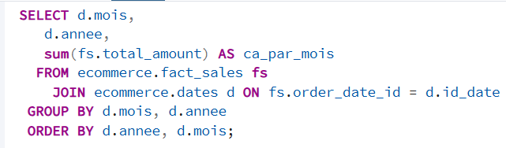
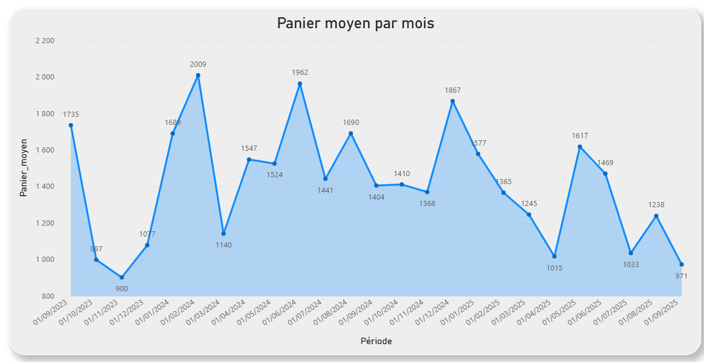
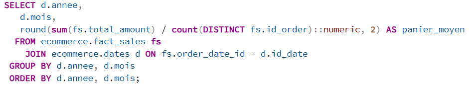
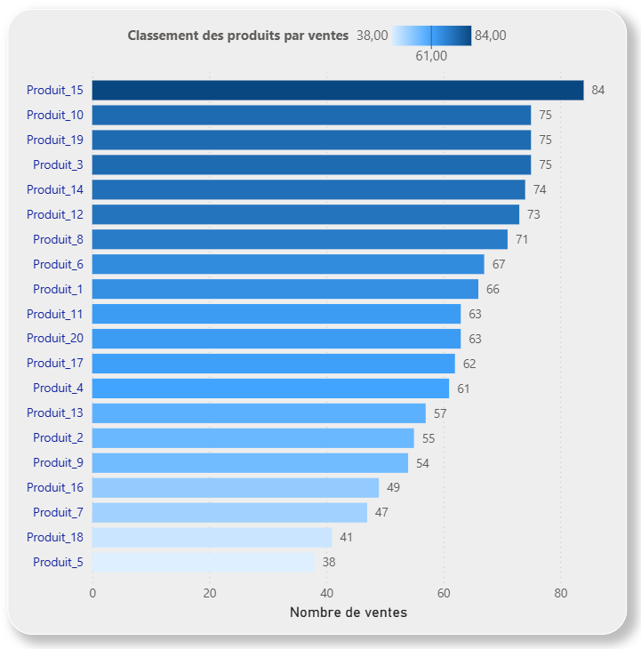
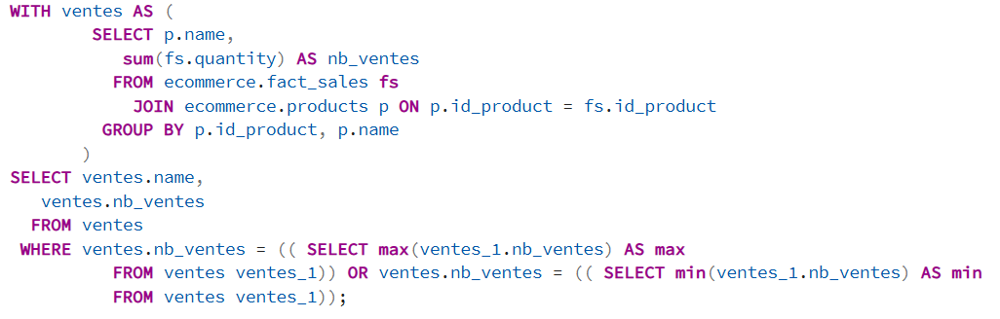
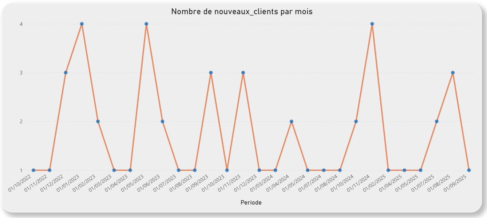
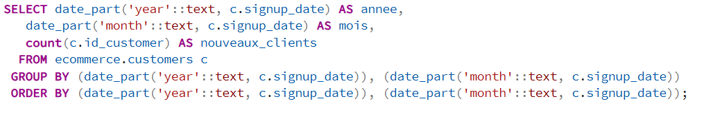
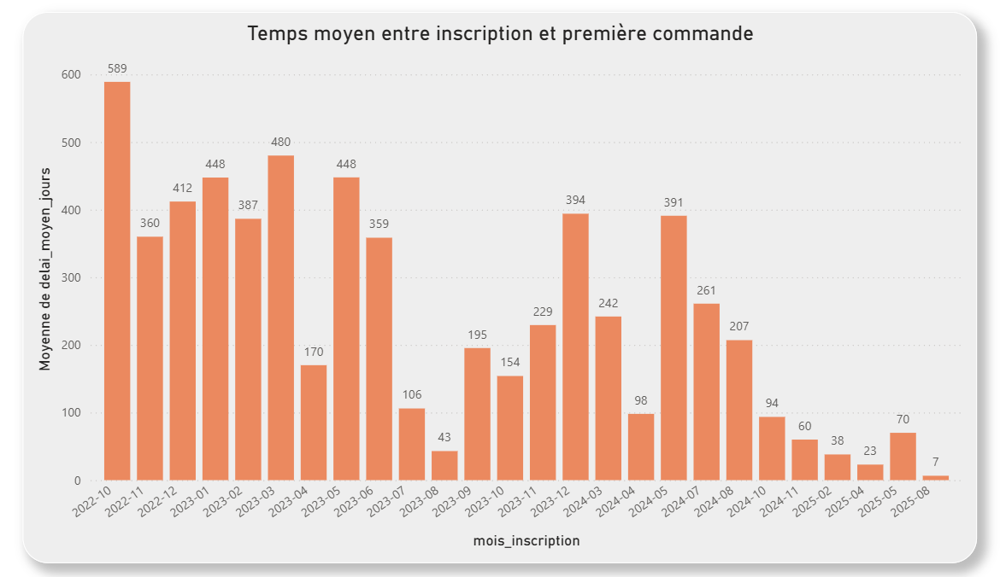
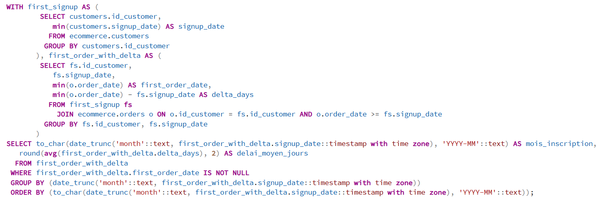

# Analyse des Indicateurs Clés de Performance (KPIs)
## Contexte du projet

Ce projet a pour objectif d’analyser la performance commerciale du site ecommerce ShopSmart à travers plusieurs **indicateurs clés (KPIs)** liés au comportement des clients.  
L’étude vise à fournir des **insights exploitables** pour les équipes marketing, produit et direction afin d’orienter les décisions stratégiques et opérationnelles.

Les données ont été traitées en Postgres, modélisation en DBTCloud et visualisées en Power BI.

## Identifications des indicateurs clés
1. Identifier les tendances d’évolution du **chiffre d’affaires** et du **panier moyen**.  
2. Comprendre le **délai de conversion** entre inscription et première commande.  
3. Identifier les **produits les plus performants** et ceux à faible rotation.  
4. Suivre l’évolution du **nombre de nouveaux clients par mois**.  

## Définition des rôles
- Data analyst
- Admin

## Source de données
- orders.csv
- order_items.csv
- customers.csv
- products.csv

## Création de la base de données Postgrès

## Gestion des rôles 

## Indicateurs clés de performance (KPIs)

### 1. KPI - Chiffre d’affaires par mois
- **Définition :** Somme totale des ventes réalisées chaque mois. 
- **Intérêt :** Montre la performance mensuelle. 

- **Création de la vue CA_par_mois dans la base Postgres**

### 2. KPI - Panier moyen par mois
- **Définition :** Montant moyen dépensé par commande. 
- **Intérêt :** Indique la capacité de l’entreprise à attirer de nouveaux clients par des campagnes promotionnelles.

- **Création de la vue panier_moyen dans la base Postgres**

### 3. KPI - Classement des produits (du plus vendu au moins vendu)
- **Définition :** Classement des produits selon la quantité vendue.
- **Intérêt :** Met en évidence les best-sellers et les produits à faible performance pour ajuster la stratégie produit et les stocks.

- **Création de la produits du plus au moins vendus dans la base Postgres**

### 4. KPI - Nombre de nouveaux clients par mois
- **Définition :** Nombre d’utilisateurs ayant inscrit au site ecommerce.  
- **Intérêt :** Indique la capacité de l’entreprise à attirer de nouveaux clients et à maintenir une acquisition régulière.

- **Création du nombre de nouveaux clients dans la base Postgres**

### 5. KPI - Temps moyen entre inscription et première commande
- **Définition :** Nombre moyen de jours de la tendance entre la date d’inscription et la première commande.  
- **Intérêt :** Mesure l’efficacité du parcours client initial et  la rapidité de conversion.

- **Création du temps moyen entre inscription et première commande dans la base Postgres**

##  Auteurs
**Projet Data – Étude des performances ecommerce**  
Développé par : Teddy PRIVAT et Ronalyn PEQUET

